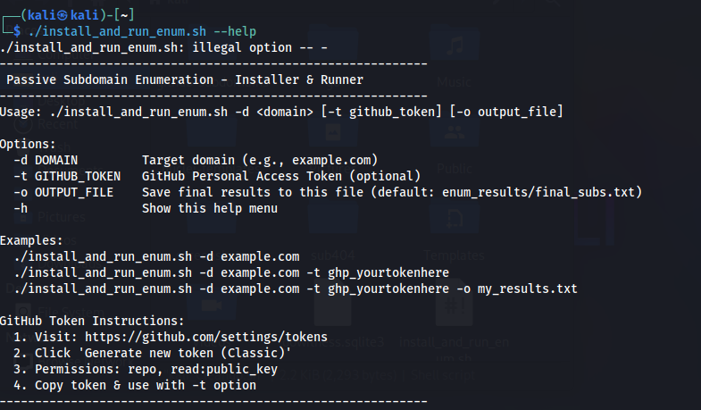

# Passive-Subdomain-Enumeration---Installer-Runner
A **bash-based automation tool** for passive subdomain enumeration. The script installs essential tools and runs multiple subdomain enumeration methods to gather subdomains efficiently.

---

## Features

- Installs essential passive subdomain enumeration tools automatically  
- Runs multiple tools for comprehensive results  
- Supports GitHub Personal Access Token for GitHub-based enumeration  
- Saves results to a customizable output file  

---

## Installation

1. Clone the repository:  
```bash
git clone https://github.com/yourusername/passive-subdomain-enum.git
cd passive-subdomain-enum
````

2. Make the script executable:

```bash
chmod +x install_and_run_enum.sh
```

---

## Usage

```bash
./install_and_run_enum.sh -d <domain> [-t github_token] [-o output_file]
```

### Options:

* `-d DOMAIN` – Target domain (e.g., example.com) **\[Required]**
* `-t GITHUB_TOKEN` – GitHub Personal Access Token (optional)
* `-o OUTPUT_FILE` – Save final results to this file (default: `enum_results/final_subs.txt`)
* `-h` – Show this help menu

### Examples:

```bash
# Basic enumeration
./install_and_run_enum.sh -d example.com

# Using GitHub token
./install_and_run_enum.sh -d example.com -t ghp_yourtokenhere

# Custom output file
./install_and_run_enum.sh -d example.com -t ghp_yourtokenhere -o my_results.txt
```

---

## GitHub Token Instructions

1. Visit [GitHub Tokens](https://github.com/settings/tokens)
2. Click **Generate new token (Classic)**
3. Set permissions: `repo`, `read:public_key`
4. Copy the token and use it with the `-t` option

---

## Output

* Creates a directory `enum_results/` (if not present)
* Saves final subdomains in `final_subs.txt` or a custom file defined with `-o`


